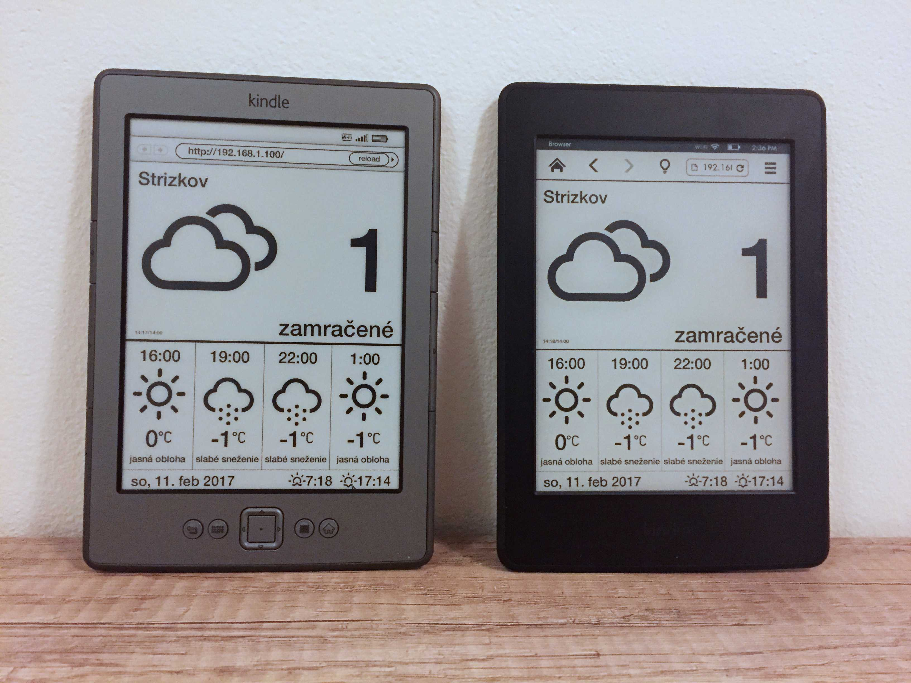
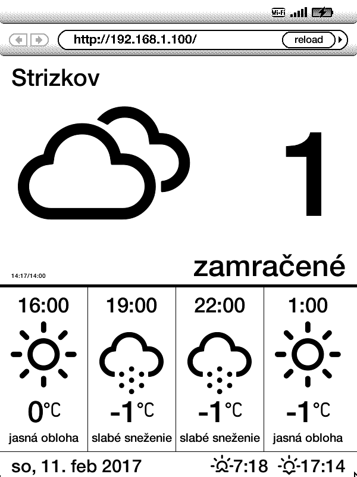

# kindle-weather-dashboard

Simple webpage with weahter informations.
* tested on **Kindle 3/4/5, Paperwhite 3, iPad Air**, *maybe works on other kindles and devices*,
* **portrait and landscape mode**
* **landscape mode on Paperwhite!!** see configuration
* configurable place, units, language
* night mode
* features:
  * **current weather and temperature**
  * **forecast for next 12 hours**, in landscape mode for **15 hours**
  * **sunrise and sunset**
  * **Moon phase**

* Weather and forecast source: https://openweathermap.org/
* Icons source: https://github.com/erikflowers/weather-icons

# How to install
1. clone or download repository
2. set your location and others in `config.js`
3. upload to your server, or simply create local (e.g with php: `php -S 192.168.0.1:80 -t .`)
4. disable screensaver on your Kindle:
  * press search button (or keyboard button on Kindle 4) on homescreen and type: `;debugOn` and press enter on keyboard
  * press search button (or keyboard button on Kindle 4) again and type: `~disableScreensaver` and press enter on keyboard. (On kindle Paperwhite type: `~ds`
5. launch your browser and go to url of your server
6. Dashboard don't need connection to your server (you can shutdown local server now) Dashboard calls api directly.

## Configuration
### with config.js
create config.js file from config.js.sample and set variables:

* `api_locParams` - query parameters to set location (e.g. `lat=50&lon=14`, or `q=Paris`)
* `api_appId` - set your `API KEY (appId)` from http://openweathermap.org/appid
* `api_lang` - output language (e.g. `en`)
* `api_units` - units (e.g. `metric`, `imperial`)
* or you can set all parameters with `api_params` varialble (e.g. `q=Prague&appid=YOUR_API_KEY&lang=sk&units=metric`
* `rotation` - set rotation (on Kindle Paperwhite) `ll` for left landscape, `lr` for right landscape and `up` for upside down
* `night_mode` - `auto` - by sunrise and sunset, `on` - always on, `HH-HH` (`22-06`) interval from-to, `off` or `null` for disabling.

See more: http://openweathermap.org/current and http://openweathermap.org/forecast5

### with url query parameters
* `appId` sets the appId
* `city` sets city, (e.g. `city=Paris`)
* `lat`, `lon` sets location (e.g. `lat=50&lon=14`)
* `lang` and `units` for lang and units :)
* `rotation` sets the rotation :)

Examples:
* Dashboard for Prague, metrics slovak language: `http://YOUR_URL/?city=Prague&lang=sk&units=metric&appId=YOUR_API_KEY`
* Dashboard for given gps, metric, default language: `https://YOUR_URL/?lat=50&lon=14&units=metric&appId=YOUR_API_KEY`

## Try it (on my server):

http://kindle.hrincar.eu/weather/

http://kindle.hrincar.eu/weather/?city=Brno

http://kindle.hrincar.eu/weather/?lat=50&lon=14&lang=en

http://kindle.hrincar.eu/weather/?lat=50&lon=14&lang=en&rotation=ll

## Screenshots

### Kindle 4

### Kindle Paperwhite 3

### Real devices

